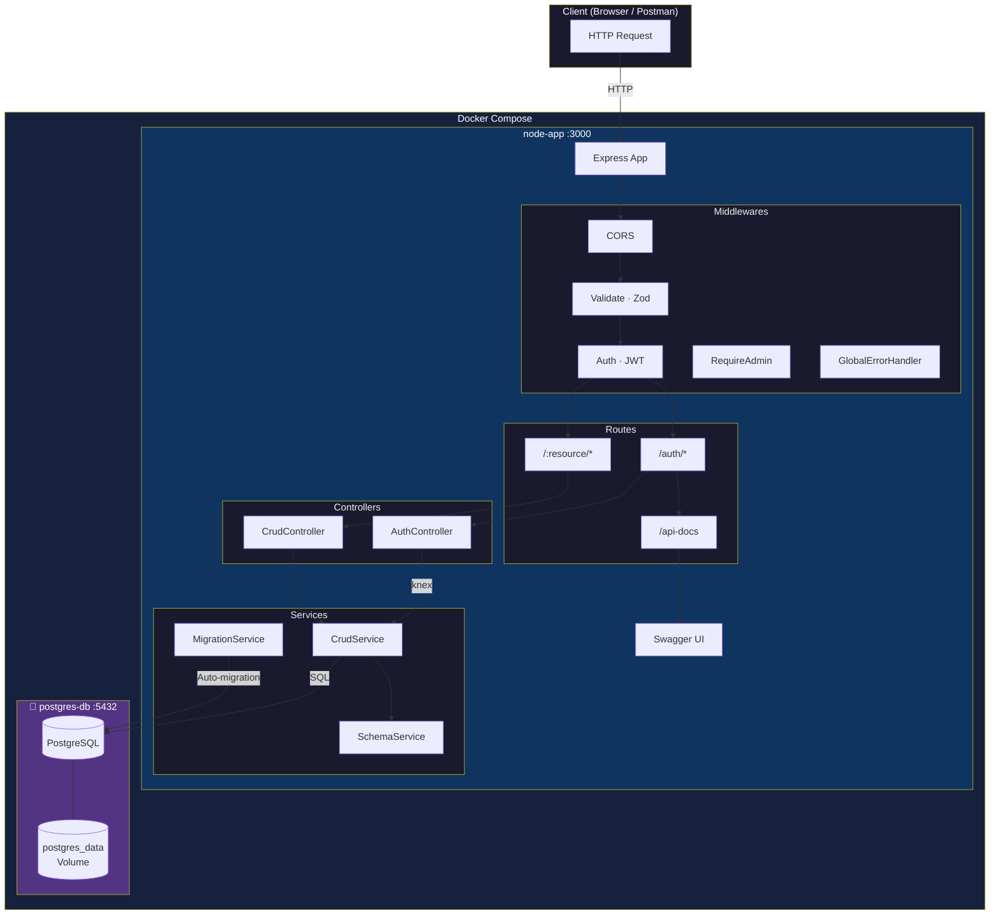

# Smart API Hub

> **Dynamic REST API** tự động sinh CRUD endpoints từ file `schema.json`.  
> Xây dựng với **Node.js · Express · TypeScript · Knex · PostgreSQL · Docker**.

---

## Architecture Diagram



---

## Hướng dẫn chạy

### Cách 1 – Docker Compose (Khuyên dùng)

> **Yêu cầu**: Docker Desktop đang chạy.

```bash
# 1. Clone repo
git clone <repo-url>
cd nodejs

# 2. Tạo file .env từ mẫu
cp .env.example .env
# Chỉnh sửa JWT_SECRET trong .env nếu cần

# 3. Build và khởi chạy toàn bộ stack
docker compose up --build

# Server sẵn sàng tại: http://localhost:3000
# Swagger UI tại:      http://localhost:3000/api-docs
```

**Dừng và xóa containers:**
```bash
docker compose down          # Giữ data volume
docker compose down -v       # Xóa luôn data volume
```

---

### Cách 2 – Local Development

> **Yêu cầu**: Node.js ≥ 22, PostgreSQL đang chạy local.

```bash
# 1. Cài dependencies
npm install

# 2. Cấu hình môi trường
cp .env.example .env
# Điền đầy đủ DB_HOST, DB_PORT, DB_USERNAME, DB_PASSWORD, DB_DATABASE, JWT_SECRET

# 3. Chạy dev server (hot-reload)
npm run dev

# Server tại: http://localhost:3000
```

---

## Chạy Tests

```bash
npm test           # Chạy toàn bộ test suite (Vitest + Supertest)
npm run test:watch # Watch mode – tự reload khi có thay đổi
```

Test coverage:
| File | Tests | Coverage |
|---|---|---|
| `auth.test.ts` | 9 tests | Register (201/400/409), Login (200/400/401) |
| `crud.test.ts` | 8 tests | GET/POST/DELETE (200/201/400/401/403/404) |

---

## API Endpoints

### System

| Method | Endpoint | Mô tả |
|--------|----------|-------|
| `GET` | `/health` | Health check – kiểm tra server & DB |
| `GET` | `/api-docs` | Swagger UI |

### Auth

| Method | Endpoint | Auth | Mô tả |
|--------|----------|------|-------|
| `POST` | `/auth/register` | ❌ | Đăng ký tài khoản |
| `POST` | `/auth/login` | ❌ | Đăng nhập, nhận JWT token |

### CRUD (Dynamic – dựa theo `schema.json`)

| Method | Endpoint | Auth | Role | Mô tả |
|--------|----------|------|------|-------|
| `GET` | `/:resource` | ❌ | – | Lấy danh sách, hỗ trợ filter/sort/page |
| `GET` | `/:resource/:id` | ❌ | – | Lấy bản ghi theo ID |
| `POST` | `/:resource` | ✅ JWT | user/admin | Tạo bản ghi mới |
| `PUT` | `/:resource/:id` | ✅ JWT | user/admin | Cập nhật toàn bộ |
| `PATCH` | `/:resource/:id` | ✅ JWT | user/admin | Cập nhật một phần |
| `DELETE` | `/:resource/:id` | ✅ JWT | **admin only** | Xóa bản ghi |

### Query Parameters cho GET

| Param | Ví dụ | Mô tả |
|-------|-------|-------|
| `_page` | `?_page=1` | Số trang |
| `_limit` | `?_limit=10` | Số bản ghi/trang |
| `_sort` | `?_sort=price` | Sắp xếp theo cột |
| `_order` | `?_order=desc` | Chiều sắp xếp |
| `_fields` | `?_fields=id,name` | Chọn cột trả về |
| `_expand` | `?_expand=users` | Expand quan hệ cha |
| `_embed` | `?_embed=products` | Embed quan hệ con |
| `q` | `?q=laptop` | Full-text search |
| `field_gte` | `?price_gte=100` | Lọc ≥ giá trị |
| `field_lte` | `?price_lte=500` | Lọc ≤ giá trị |
| `field_like` | `?name_like=phone` | Lọc ILIKE |
| `field_ne` | `?role_ne=admin` | Lọc ≠ giá trị |

---

## Postman Collection

Import file [`postman_collection.json`](./postman_collection.json) vào Postman:

1. Mở Postman → **Import** → chọn file `postman_collection.json`
2. Đặt biến `base_url = http://localhost:3000`
3. Chạy **Login** → token sẽ tự động lưu vào biến `{{token}}`
4. Tất cả request có auth sẽ dùng `{{token}}` tự động

---

## Cấu hình schema.json

Định nghĩa cấu trúc database qua `schema.json` – app sẽ tự động tạo bảng khi khởi động:

```json
{
  "tables": [
    {
      "name": "products",
      "columns": [
        { "name": "id", "type": "uuid", "primary": true, "default": "gen_random_uuid()" },
        { "name": "title", "type": "string", "nullable": false },
        { "name": "price", "type": "number", "nullable": false },
        { "name": "user_id", "type": "uuid", "foreignKey": { "table": "users", "column": "id", "onDelete": "CASCADE" } }
      ]
    }
  ]
}
```

**Hỗ trợ types**: `uuid`, `string`, `text`, `number`, `boolean`, `timestamp`, `enum`

---

## Tech Stack

| Layer | Technology |
|-------|-----------|
| Runtime | Node.js 22 |
| Framework | Express 5 |
| Language | TypeScript 5 |
| ORM/Query | Knex.js |
| Database | PostgreSQL 17 |
| Validation | Zod v4 |
| Auth | JWT (jsonwebtoken) |
| Testing | Vitest + Supertest |
| Docs | Swagger UI (OpenAPI 3.0) |
| Container | Docker + Docker Compose |

---

## Project Structure

```
src/
├── config/
│   ├── data-source.ts      # Knex DB connection
│   └── swagger.ts          # OpenAPI 3.0 spec
├── controllers/
│   ├── auth.controller.ts  # Register / Login
│   └── crud.controller.ts  # Dynamic CRUD
├── middlewares/
│   ├── auth.middleware.ts         # JWT verify
│   ├── error.middleware.ts        # Global error handler
│   ├── resource-whitelist.middleware.ts
│   └── validate.middleware.ts     # Zod validation factory
├── routes/
│   ├── auth.route.ts
│   └── crud.route.ts
├── services/
│   ├── crud.service.ts       # Business logic CRUD
│   ├── schema.service.ts     # Schema parser
│   └── migrations.service.ts # Auto-migration
├── tests/
│   ├── auth.test.ts
│   └── crud.test.ts
├── validators/
│   ├── auth.validator.ts
│   └── crud.validator.ts
├── app.ts
└── index.ts
schema.json              # Database schema definition
docker-compose.yml
Dockerfile
postman_collection.json
```
